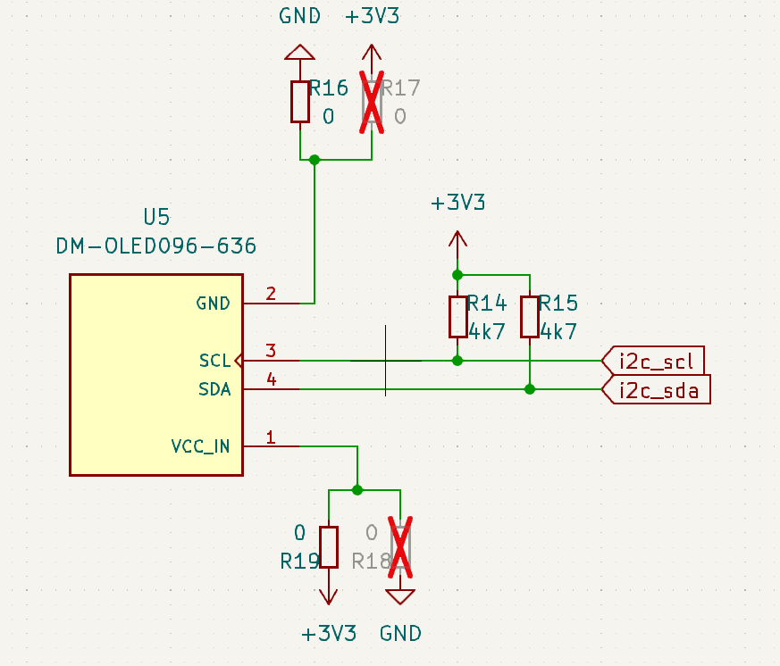
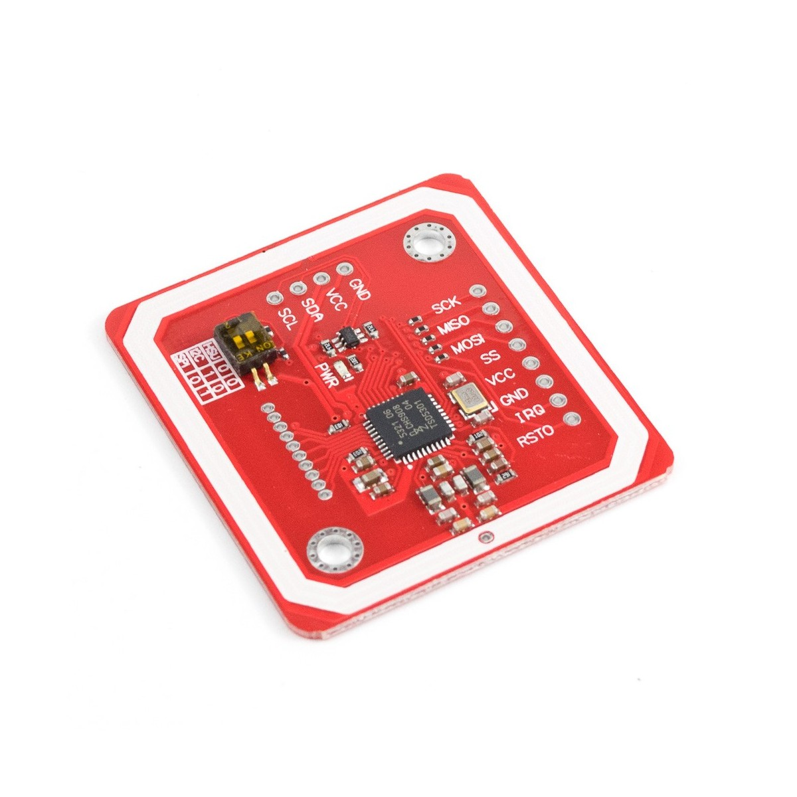
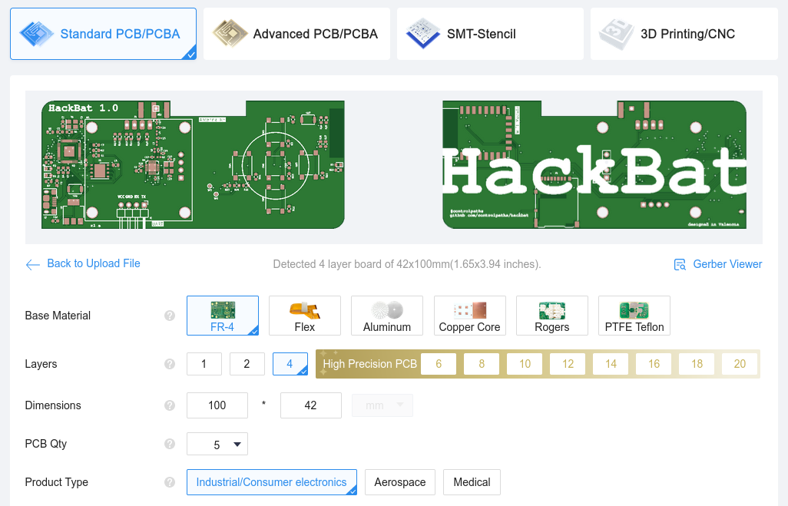

# Hackbat

HackBat is an open-source device designed for hackers and makers to experiment with different pen-testing techniques. The device is based on the Raspberry Pi RP2040 microcontroller and has an RF transceiver, NFC, WIFI, OLED display...

## RP2040

The Raspberry Pi [RP2040](https://www.raspberrypi.com/products/rp2040/specifications/) is the brain of the HackBat. The main features of this MCU are:

- Dual-core Arm Cortex-M0+ processor, flexible clock running up to 133 MHz 264kB on-chip SRAM
- 2 × UART 
- 2 × SPI controllers
- 2 × I2C controllers
- 16 × PWM channels
- 1 × USB 1.1 controller and PHY, with host and device support
- 8 × Programmable I/O (PIO) state machines for custom peripheral support
- Operating temperature -40°C to +85°C
- Drag-and-drop programming using mass storage over USB
- Low-power sleep and dormant modes
- Temperature sensor
- Accelerated integer and floating-point libraries on-chip

The RP2040 can be programmed using Arduino IDE, Python or C++.

## Display

The OLED display used in the HackBat is a 128x64 pixels, with the driver SH110X. The device also allows OLED with SSD1306, but notice that the VCC and GND pins are reversed, so you need to change the 0 ohm resistors of those pins.

## RF

The Hackbat features a [CC1101](https://www.ti.com/product/CC1101) from Texas instruments. CC1101 is a low-cost sub-1 GHz transceiver designed for very low-power wireless applications. The circuit is mainly intended for the ISM (Industrial, scientific and Medical) and SRD (Short Range Device) frequency bands at 315, 433, 868, and 915 MHz, but can easily be programmed for operation at other frequencies in the 300-348 MHz, 387-464 MHz and 779-928 MHz bands

## WIFI

The hackBat features an ESP8266 module, the ESP-12F. This module allow either the HackBat to connect a WIFI network, or generate an access point to allow connections.

The ESP-12F modules can be programmed using the Arduino IDE and the UART conenction. In the HackBat, the ESP-12F is programmed through the RP2040 by using it as USB-UART bridge.

## NFC

HackBat has NFC communication at 13.56MHz. The IC in charge of this peripheral is the [PN532].

PN532 is a highly integrated transceiver module for contactless communication at 13.56 MHz based on the 80C51 microcontroller core supporting different card and reader/writer operating modes.

HackBat uses [this](https://es.aliexpress.com/item/1005006005040320.html?spm=a2g0o.productlist.main.13.65b05927VOBhfq&algo_pvid=9ccfed98-181b-4e28-b2be-488f5ec17187&algo_exp_id=9ccfed98-181b-4e28-b2be-488f5ec17187-6&pdp_npi=4%40dis%21EUR%218.71%210.99%21%21%2166.15%217.50%21%402103854017142998536557342eb34a%2112000035367480068%21sea%21ES%210%21AB&curPageLogUid=pD9zsZTxZuDe&utparam-url=scene%3Asearch%7Cquery_from%3A) integrated module with the PN532.

The communication with the RP2040 is I2C.

## Keyboard emulation

Since the RP2040 has USB host/Device, the HackBat can be used as a keyboard emulator using the Arduinoi `keyboard.h` library.

## Get Yours

The HackBat is open-source, so you can use the output files to manufacture your own in [JLCPCB](https://jlcpcb.com/?from=controlpath). You just need to compress the `output_files` directory, and upload it to [JLCPCB](https://jlcpcb.com/?from=controlpath). 

Remember to change the Surface Finish to **LeadFree HASL** to make your board ROHS compliant.

Then you have to add the PCB Assembly service and upload the [centroid](./kicad/hackbat/production_files/hackbat-all-pos.csv) file, and the [BOM](./kicad/hackbat/production_files/bom.csv). 

In a few days, you will receive your board at home.
